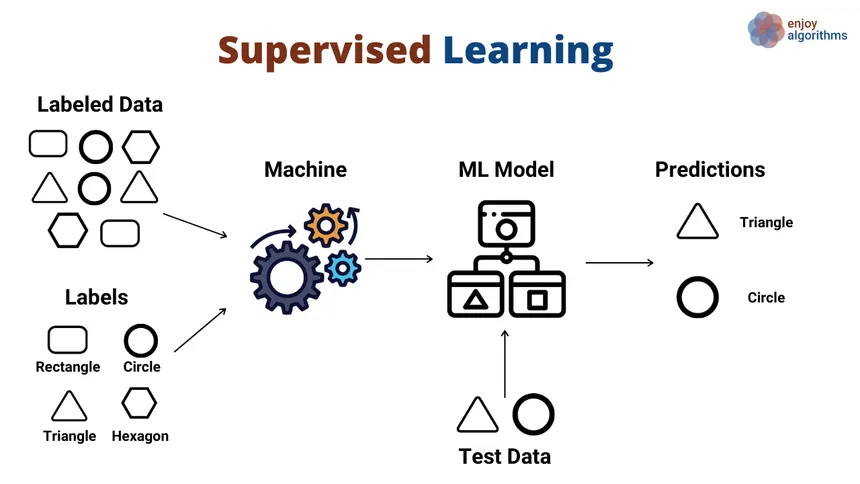
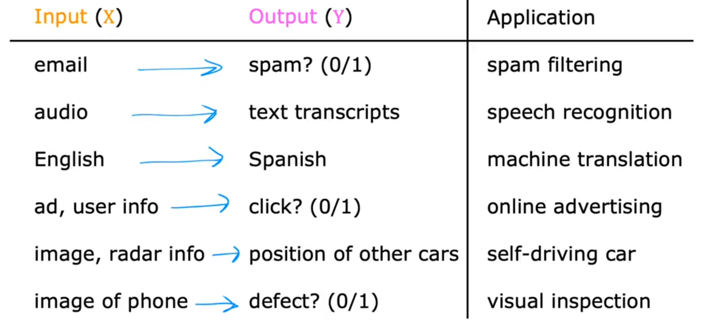
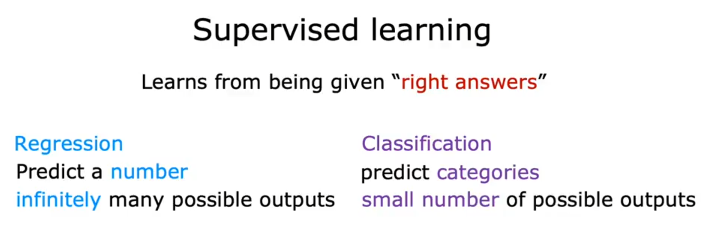
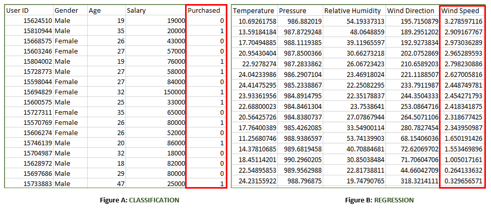
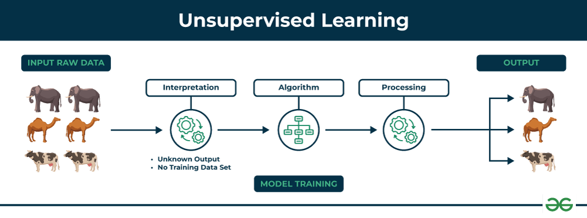
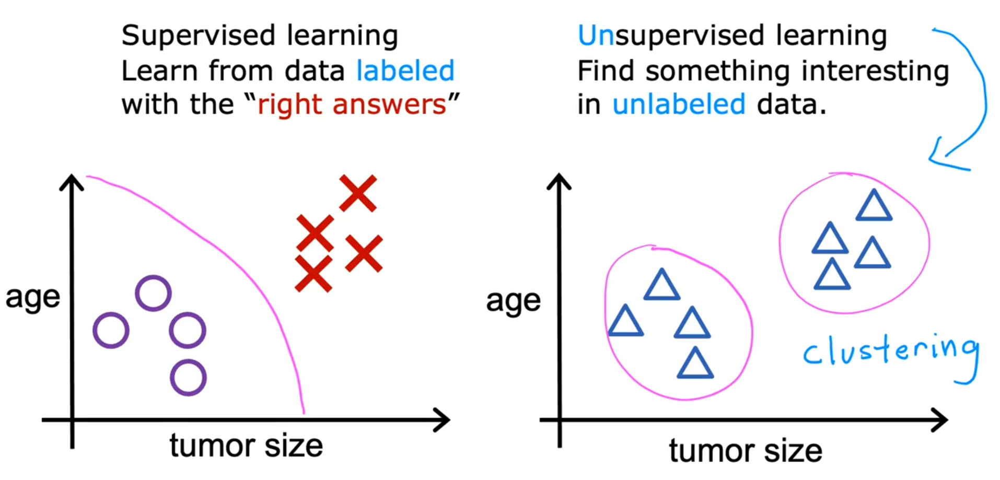
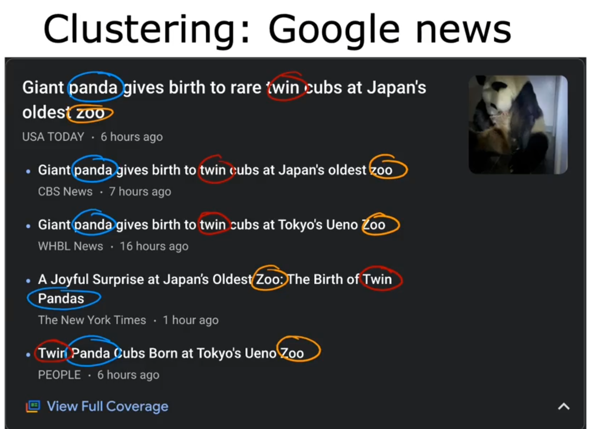

# **Machine learning** 
**"Field of study that gives computers the ability to learn without being explicitly programmed "** -- Arthur samuel
# ML Algorithms 
1. Supervised Learning
    - it has seen the most rapid advancements
    - Used in most real world applications .
2. Unsupervised Learning 
3. Recommender System 
4. Reinforcement Learning

# **Supervised Learning** 

- It refers to the algorithms that learn x to y (x -> y) or input to output (input -> output) .
- It involves training a model using labeled data, where each input comes with a corresponding correct output.
- The goal of supervised learning is for the model to learn a mapping from inputs to outputs, so that when it is given new, unseen inputs, it can accurately predict the corresponding output labels.
- A fundamental concept in supervised machine learning is learning a class from examples. This involves providing the model with examples where the correct label is known, such as learning to classify images of cats and dogs by being shown labeled examples of both. The model then learns the distinguishing features of each class and applies this knowledge to classify new images.

- Examples :-

## Types of Supervised Learning in Machine Learning
Now, Supervised learning can be applied to two main types of problems:

1. Classification: Where the output is a categorical variable , Small number of possible outputs (e.g.,Breast Cancer Detection , spam vs. non-spam emails, yes vs. no).
2. Regression: Where the output is a continuous variable (e.g., predicting house prices, stock prices).

- 
- 

# **Unsupervised Learning** 

- It involves training a data using Unlabeled data .
- unsupervised learning algorithms are tasked with finding patterns and relationships within the data without any prior knowledge of the data's meaning .
- 
- 

## Unsupervised Learning Algorithms
There are mainly 3 types of Algorithms which are used for Unsupervised dataset.

1. **Clustering :** Clustering in unsupervised machine learning is the process of grouping unlabeled data into clusters based on their similarities. The goal of clustering is to identify patterns and relationships in the data without any prior knowledge of the data's meaning.
2. **Association Rule Learning :** This technique is a rule-based ML technique that finds out some very useful relations between parameters of a large data set. This technique is basically used for market basket analysis that helps to better understand the relationship between different products
3. **Dimensionality Reduction :** Dimensionality reduction is the process of reducing the number of features in a dataset while preserving as much information as possible. This technique is useful for improving the performance of machine learning algorithms and for data visualization.

- example of Clustering algorithm 
- 